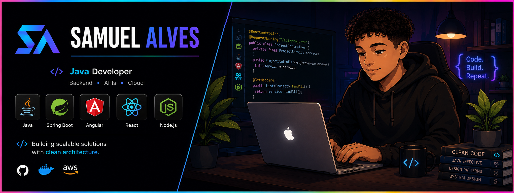

<div align="center">




### ☕ Java Developer • Full Stack Developer

Building scalable solutions with clean architecture.

</div>

<div align="center">


</div>


## About Me

-  Hello! My name is Samuel Alves and I'm a Java Developer passionate about building scalable software solutions.

- 🧠 My current goal is to become a Software Architect and Cloud Engineer.

- ☕ My main stack is Java with Spring Boot, Angular, React and Node.js.

-  Currently studying Azure, Docker, Linux, DevOps and Software Architecture.

-  Passionate about Clean Code, Design Patterns and Backend Development.

-  Building modern web applications and scalable backend systems.

- 🔥 Always learning, building and improving every day.

##  My Stack

<div align="center">


</div>

---

##  GitHub Statistics

<div align="center">


</div>

---

##  GitHub Streak

<div align="center">


</div>

---

##  Featured Projects

### 📊 LogControll V2

Monitoring and auditing platform for application logs.

**Tech Stack**

* Node.js
* Angular
* MySQL
* JWT Authentication
* Audit Logs

---

##  Connect With Me

<div align="left">

<a href="https://linkedin.com/in/samuel-duarte-alves">

</a>

<a href="mailto:samuelalves192119@gmail.com">

</a>

</div>

---

##  Current Focus

```java
public class SamuelAlves {

    private final String role = "Java Developer";

    private final String[] focus = {
        "Spring Boot",
        "Angular",
        "React",
        "Azure",
        "Docker",
        "Linux",
        "Software Architecture"
    };

    public void keepLearning() {
        while (true) {
            code();
            learn();
            improve();
        }
    }
}
```

---

##  Profile Views

<div align="center">


</div>

---

<div align="center">

### Code. Build. Repeat. 🚀

</div>
